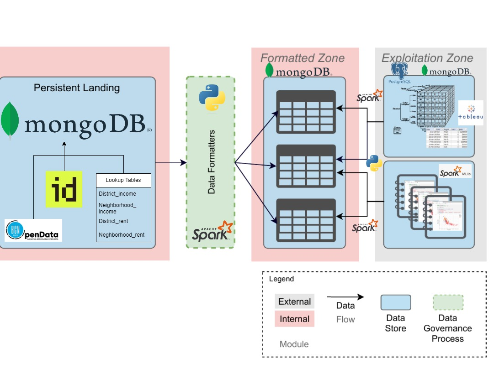
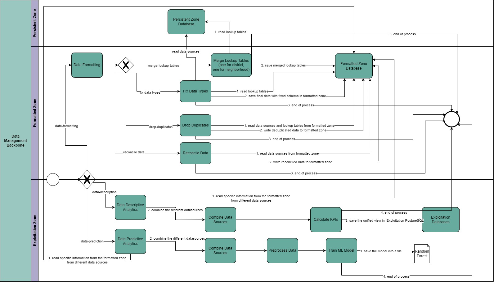
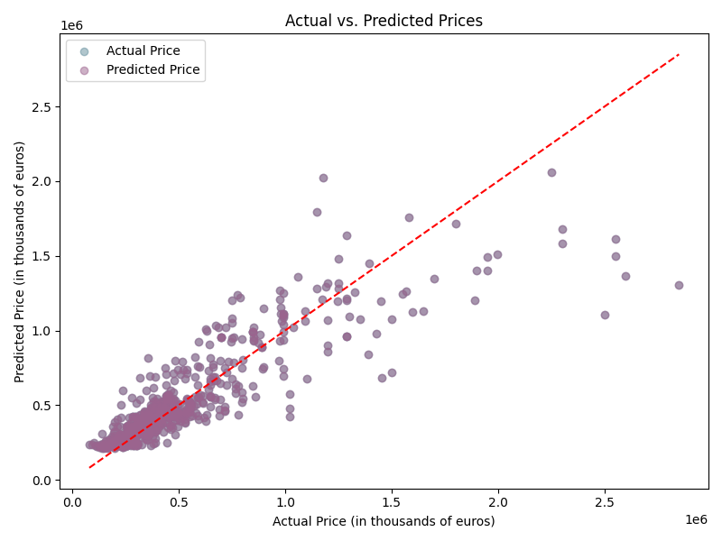
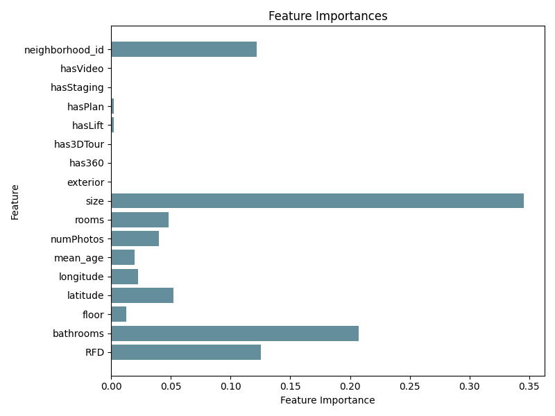

# Big Data Management - Universitat Politècnica de Catalunya
## Implementation of a (Big) Data Management Backbone
### Barcelona Rentals - Territorial Income Distribution - Age of Buildings
This part of the project is focused on the `Formatted and Exploitation Zones` of the Data Management Backbone
***
### System's Design and BPMN

In the following two figures the `system's design` and its `BPMN` are depicted.



### Instructions for Executing the Code

- Download Python version 3.10
- Clone this repository locally
  - ``` git clone https://github.com/odyskypa/spark-formatted-exploitation-zones.git```
- Create a virtual environment with Python 3.10 interpreter and run the following command to install the required libraries:
  - ```
      pip install requirements.txt
    ```
- Add a `.env` file inside `spark-formatted-exploitation-zones` folder, including the following parameters with their appropriate values:
  - ```
    VM_HOST="..."
    VM_USER="..."
    MONGODB_PORT=27017
    PERSISTENT_DB="persistent"
    FORMATTED_DB="formatted"
    EXPLOITATION_DB="exploitation"
    ```
- The project is divided into 3 main parts:
  - [The Data Formatting Processes](https://github.com/odyskypa/BDM-Spark/blob/main/src/data_formatters/data_formatter.py)
  - [The Descriptive Analytics](https://github.com/odyskypa/BDM-Spark/blob/main/src/descriptive_analysis/data_description.py)
  - [The Predictive Analytics](https://github.com/odyskypa/BDM-Spark/blob/main/src/predictive_analysis/data_modeling.py)
- For executing the `Data Formatting` processes in order to `fix data-types`, `drop-duplicates` and `reconcile` the data sources
make use of the following commands, with the respective order:
  - ``` 
    python main.py data-formatting merge-lookup-tables
    python main.py data-formatting fix-data-types
    python main.py data-formatting drop-duplicates
    python main.py data-formatting reconcile-data
    ```
- Moreover, the `Descriptive Analytics` functionality can be used in order to prepare the necessary data for the KPIs and use them inside `Tableau`:
  - ```
    python main.py data-description
    ```
- Lastly, for executing the `Predictive Analytics` processes, which trains a `Random Forest Classifier` for predicting the price of a new house in Barcelona, given certain characteristics, follow the command below:
  - ```
      python main.py data-prediction train-model
      ```

### Tableau Dashboard of the Descriptive Analyics
By following this [link](https://public.tableau.com/app/profile/mar.al.garcia/viz/BDM2_Kyparissis_Garcia/Dashboard1) one can take a look at descriptive analytics for the city of Barcelona.

### Performance of Random Forest Classifier
The following two figures present the capability of the final model to predict future values of house prices based on the input features.
***

***

